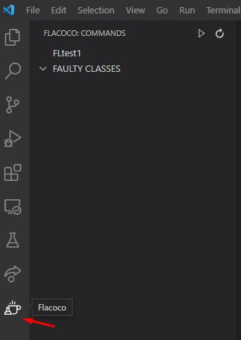
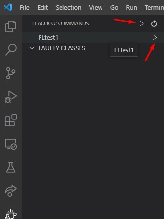
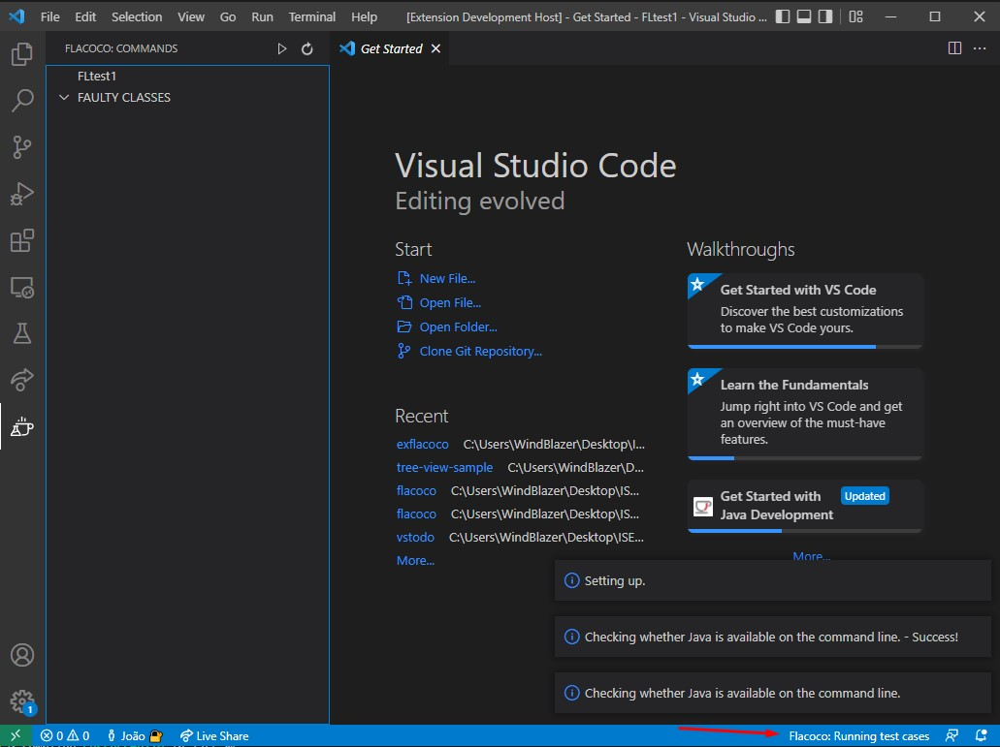
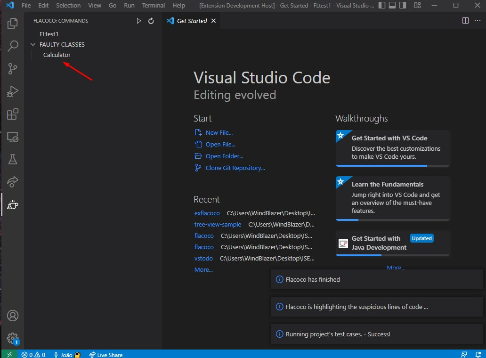
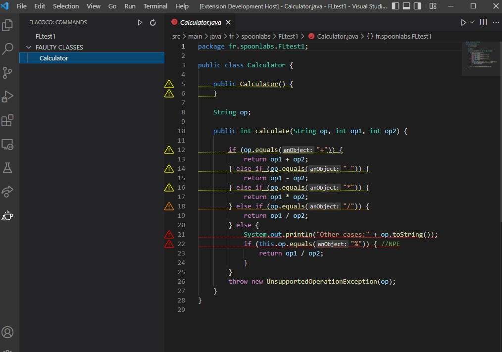
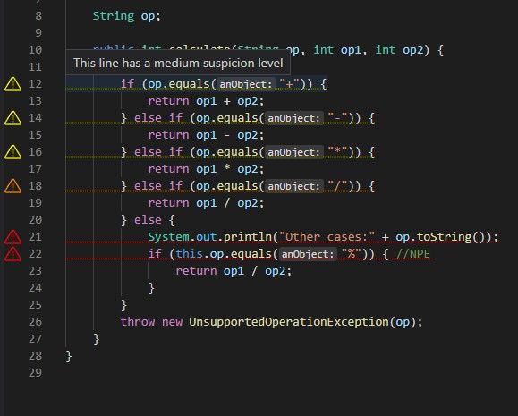

# flacoco README

**flacocovscode** is an extension for Visual Studio Code of the fault localization tool for Java named [flacoco](https://github.com/SpoonLabs/flacoco). This extension aims to facilitate and simplify the use of Fault Localization tools for the average programmer by making it more accessible.

## Requirements

Before using Flacoco's Visual Studio Code extension, a few requirements have to
be considered in order to use its functionalities.

- **JDK**  Flacoco's Visual Studio Code extension runs on Java 8 to Java 17.
  
- **Tests** Flacoco's Visual Studio Code supports JUnit3, JUnit4 and JUnit5.

- **Build Tool**  Flacoco Visual Studio Code extension is
  automatically activated on projects that use one of the following build tools:
  [Apache Maven](https://maven.apache.org), [Gradle](https://gradle.org) or [Apache Ant](https://ant.apache.org) .

- **Environment**  Windows, Linux and MacOS are compatible with Flacoco.

## Setup

There are two ways to install Flacoco's Visual Studio plugin from the marketplace. The first alternative is available from within the Visual
Studio Code by selecting the Extensions icon in the view container (or simply `Shift+Cmd+X` on macOS and `Ctrl+Shift+X` on Windows and Linux).
Then, you may use the prompt to look for Flacoco and install it.

Alternatively, you may download and install the extension from the

## Using Flacoco Visual Studio Code Extension

If your project meets the [requirements](#Requirements), the icon of the Flacoco's Visual Studio code extension will show up in
your View Container. 

After clicking the icon, an UI with the name of your opened folder, a separator for the Faulty Classes the extension will find and some icons
to run and refresh. You can run the extension by either click the top Run button or the one that shows up by hovering the name of your project.

Then you run the extension and a Status Bar and Information logs will show up to keep you updated what the extension is doing.

When it is completed, the Faulty Classes separator will be filled with the encountered classes with the faulty lines of code.

Afterwards, you can click the name of the Faulty Class to open it. Next, you will find that the faulty lines of code
are highlighted according to its level of suspiciousness. 

It is worth mentioning that, in order to be colorblind friendly, the extension tells you the level of suspiciousness if you hover a certain line.
.

### 1.0.0

Initial release of flacocovscode.

